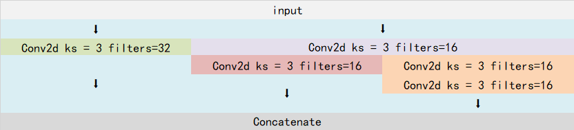

# 什么是Retinaface人脸检测算法

Retinaface是来自insightFace的又一力作，基于one-stage的人脸检测网络。
同时开源了代码与数据集，在widerface上有非常好的表现。

> Retinaface是人脸检测
>
> Facenet是人脸识别
>
> Retinaface检测人脸并截取,进行校正,传递给Facenet进行编码,获得长度128的特征向量,对比数据库,求欧氏距离,找最短距离,查看是否小于门限,如果小于就是这个人


# 源码下载

https://github.com/bubbliiiing/retinaface-pytorch
喜欢的可以点个star噢。

# Retinaface实现思路

## 一、预测部分

### 1、主干网络介绍


Retinaface在实际训练的时候使用两种网络作为主干网络。分别是MobilenetV1-0.25和Resnet。

**使用Resnet可以实现更高的精度，使用MobilenetV1-0.25可以在CPU上实现实时检测。**

本文以MobilenetV1-0.25进行展示。

MobileNet模型是Google针对手机等嵌入式设备提出的一种轻量级的深层神经网络，其使用的核心思想便是depthwise separable convolution。

对于一个卷积点而言：
 **假设有一个3×3大小的卷积层，其输入通道为16、输出通道为32。具体为，32个3×3大小的卷积核会遍历16个通道中的每个数据，最后可得到所需的32个输出通道，所需参数为16×32×3×3=4608个。**

**应用深度可分离卷积，用16个3×3大小的卷积核分别遍历16通道的数据，得到了16个特征图谱。在融合操作之前，接着用32个1×1大小的卷积核遍历这16个特征图谱，所需参数为16×3×3+16×32×1×1=656个。**

可以看出来depthwise separable convolution可以减少模型的参数。

如下这张图就是depthwise separable convolution的结构


**在建立模型的时候，可以将卷积group设置成in_filters层实现深度可分离卷积，然后再利用1x1卷积调整channels数。**

通俗地理解就是3x3的卷积核厚度只有一层，然后在输入张量上一层一层地滑动，每一次卷积完生成一个输出通道，当卷积完成后，在利用1x1的卷积调整厚度。

**如下就是MobileNet的结构，其中Conv dw就是分层卷积，在其之后都会接一个1x1的卷积进行通道处理，**


上图所示是的mobilenetV1-1的结构，本文所用的mobilenetV1-0.25是mobilenetV1-1通道数压缩为原来1/4的网络。


> nets/mobilenet025.py

```python
#---------------------------------------------------#
#   MobileNetV1-0.25
#   宽度为原版的0.25倍
#---------------------------------------------------#

import torch.nn as nn

#---------------------------------------------------#
#   Conv+BN+LeakyReLU
#---------------------------------------------------#
def conv_bn(inp, oup, stride = 1, leaky = 0.1):
    return nn.Sequential(
        nn.Conv2d(inp, oup, 3, stride, 1, bias=False),
        nn.BatchNorm2d(oup),
        nn.LeakyReLU(negative_slope=leaky, inplace=True)
    )

#---------------------------------------------------#
#   dw+pw
#   3x3DWConv + 1x1Conv
#---------------------------------------------------#
def conv_dw(inp, oup, stride = 1, leaky=0.1):
    return nn.Sequential(
        # 3x3Conv
        # in = put = groups
        nn.Conv2d(inp, inp, 3, stride, 1, groups=inp, bias=False),
        nn.BatchNorm2d(inp),
        nn.LeakyReLU(negative_slope= leaky,inplace=True),

        # 1x1Conv
        nn.Conv2d(inp, oup, 1, 1, 0, bias=False),
        nn.BatchNorm2d(oup),
        nn.LeakyReLU(negative_slope= leaky,inplace=True)
    )

#---------------------------------------------------#
#   MobileNetV1-0.25
#	下面注释是输入为 640,640,3的场景,输出宽高为 80, 40, 20
#	如果输入1280,1280,3时,最终宽高会翻倍,即160, 80, 40
#---------------------------------------------------#
class MobileNetV1(nn.Module):
    def __init__(self):
        super().__init__()
        self.stage1 = nn.Sequential(
            # 640,640,3 -> 320,320,8
            conv_bn(3, 8, stride = 2, leaky = 0.1),
            # 320,320,8 -> 320,320,16
            conv_dw(8, 16),

            # 320,320,16 -> 160,160,32
            conv_dw(16, 32, stride = 2),
            conv_dw(32, 32),

            # 160,160,32 -> 80,80,64
            conv_dw(32, 64, stride = 2),
            conv_dw(64, 64)
        )
        # 80,80,64 -> 40,40,128
        self.stage2 = nn.Sequential(
            conv_dw(64, 128, stride = 2),
            conv_dw(128, 128),
            conv_dw(128, 128),
            conv_dw(128, 128),
            conv_dw(128, 128),
            conv_dw(128, 128)
        )
        # 40,40,128 -> 20,20,256
        self.stage3 = nn.Sequential(
            conv_dw(128, 256, stride = 2),
            conv_dw(256, 256)
        )
        self.avg = nn.AdaptiveAvgPool2d((1,1))
        self.fc = nn.Linear(256, 1000)

    def forward(self, x):
        # 在这里打印都没效果
        # print(x.size())
        x = self.stage1(x)  # 640,640,3 -> 80,80, 64
        # print(x.size())
        x = self.stage2(x)  # 80,80, 64 -> 40,40,128
        # print(x.size())
        x = self.stage3(x)  # 40,40,128 -> 20,20,256
        # print(x.size())
        x = self.avg(x)
        # x = self.model(x)
        x = x.view(-1, 256)
        x = self.fc(x)
        return x
```

### 2、FPN特征金字塔


与Retinanet类似的是，Retinaface使用了FPN的结构，对Mobilenet最后三个shape的有效特征层进行FPN结构的构建。

构建方式很简单，首先利用1x1卷积对三个有效特征层进行通道数的调整。调整后利用Upsample和Add进行上采样的特征融合。


> nets/layers.py

```python
import torch
import torch.nn as nn
import torch.nn.functional as F


#---------------------------------------------------#
#   卷积块
#   Conv2D + BatchNormalization + LeakyReLU
#---------------------------------------------------#
def conv_bn_relu1X1(inp, oup, stride = 1, leaky=0):
    return nn.Sequential(
        nn.Conv2d(inp, oup, 1, stride, padding=0, bias=False),
        nn.BatchNorm2d(oup),
        nn.LeakyReLU(negative_slope=leaky, inplace=True)
    )

def conv_bn_relu3X3(inp, oup, stride = 1, leaky = 0):
    return nn.Sequential(
        nn.Conv2d(inp, oup, 3, stride,  padding=1, bias=False),
        nn.BatchNorm2d(oup),
        nn.LeakyReLU(negative_slope=leaky, inplace=True)
    )

#---------------------------------------------------#
#   FPN特征金字塔
#	下面注释是输入为 640,640,3的场景,输出宽高为 80, 40, 20
#	如果输入1280,1280,3时,最终宽高会翻倍,即160, 80, 40
#---------------------------------------------------#
class FPN(nn.Module):
    def __init__(self, in_channels_list, out_channels):
        super().__init__()
        leaky = 0
        if (out_channels <= 64):
            leaky = 0.1
        #-------------------------------------------#
        #   对mobilenet0.25的三个特征层进行通道改变 1x1Conv
        #-------------------------------------------#
        self.output1 = conv_bn_relu1X1(in_channels_list[0], out_channels, leaky = leaky)
        self.output2 = conv_bn_relu1X1(in_channels_list[1], out_channels, leaky = leaky)
        self.output3 = conv_bn_relu1X1(in_channels_list[2], out_channels, leaky = leaky)

        #-------------------------------------------#
        #   特征融合后的处理
        #-------------------------------------------#
        self.merge1 = conv_bn_relu3X3(out_channels, out_channels, leaky = leaky)
        self.merge2 = conv_bn_relu3X3(out_channels, out_channels, leaky = leaky)

    def forward(self, inputs):
        #-------------------------------------------#
        #   获得三个shape的有效特征层
        #       C3  80, 80,  64
        #       C4  40, 40, 128
        #       C5  20, 20, 256
        #-------------------------------------------#
        inputs = list(inputs.values())

        #-------------------------------------------#
        #   获得三个shape的有效特征层
        #       output1  80, 80,  64
        #       output2  40, 40, 128
        #       output3  20, 20, 256
        #-------------------------------------------#
        output1 = self.output1(inputs[0])
        output2 = self.output2(inputs[1])
        output3 = self.output3(inputs[2])

        #-------------------------------------------#
        #   output3上采样和output2特征融合
        #   output2  40, 40, 64
        #-------------------------------------------#
        up3 = F.interpolate(output3, size=[output2.size(2), output2.size(3)], mode="nearest")
        output2 = output2 + up3
        output2 = self.merge2(output2)

        #-------------------------------------------#
        #   output2上采样和output1特征融合
        #   output1  80, 80, 64
        #-------------------------------------------#
        up2 = F.interpolate(output2, size=[output1.size(2), output1.size(3)], mode="nearest")
        output1 = output1 + up2
        output1 = self.merge1(output1)

        # output1  80, 80, 64
        # output2  40, 40, 64
        # output3  20, 20, 64
        out = [output1, output2, output3]
        return out
```

### 3、SSH进一步加强特征提取

通过第二部分的运算，我们获得了P3、P4、P5三个有效特征层。

Retinaface为了进一步加强特征提取，使用了SSH模块加强感受野。

SSH的结构如如下所示：



SSH的思想非常简单，使用了三个并行结构，利用3x3卷积的堆叠代替5x5与7x7卷积的效果：左边的是3x3卷积，中间利用两次3x3卷积代替5x5卷积，右边利用三次3x3卷积代替7x7卷积。

这个思想在Inception里面有使用。

> nets/layers.py

```python
import torch
import torch.nn as nn
import torch.nn.functional as F


#---------------------------------------------------#
#   卷积块
#   Conv2D + BatchNormalization + LeakyReLU
#---------------------------------------------------#

def conv_bn_relu3X3(inp, oup, stride = 1, leaky = 0):
    return nn.Sequential(
        nn.Conv2d(inp, oup, 3, stride,  padding=1, bias=False),
        nn.BatchNorm2d(oup),
        nn.LeakyReLU(negative_slope=leaky, inplace=True)
    )

#---------------------------------------------------#
#   卷积块
#   Conv2D + BatchNormalization
#---------------------------------------------------#
def conv_bn_no_relu(inp, oup, stride):
    return nn.Sequential(
        nn.Conv2d(inp, oup, 3, stride, 1, bias=False),
        nn.BatchNorm2d(oup),
    )


#---------------------------------------------------#
#   多尺度加强感受野
#   1个3x3Conv 2个3x3Conv 3个3x3Conv  有padding,所以大小不变
#   最后通道为给定的out_channel
#---------------------------------------------------#
class SSH(nn.Module):
    def __init__(self, in_channel, out_channel):
        super().__init__()
        assert out_channel % 4 == 0
        leaky = 0
        if (out_channel <= 64):
            leaky = 0.1

        #-------------------------------------------#
        # 3x3卷积
        #-------------------------------------------#
        self.conv3X3 = conv_bn_no_relu(in_channel, out_channel//2, stride=1)

        #-------------------------------------------#
        # 利用两个3x3卷积替代5x5卷积
        #-------------------------------------------#
        self.conv5X5_1 = conv_bn_relu3X3(in_channel, out_channel//4, stride=1, leaky = leaky)
        self.conv5X5_2 = conv_bn_no_relu(out_channel//4, out_channel//4, stride=1)

        #-------------------------------------------#
        # 利用三个3x3卷积替代7x7卷积(包括conv5X5_1)
        #-------------------------------------------#
        self.conv7X7_2 = conv_bn_relu3X3(out_channel//4, out_channel//4, stride=1, leaky = leaky)
        self.conv7x7_3 = conv_bn_no_relu(out_channel//4, out_channel//4, stride=1)

    def forward(self, inputs):
        conv3X3 = self.conv3X3(inputs)

        conv5X5_1 = self.conv5X5_1(inputs)
        conv5X5 = self.conv5X5_2(conv5X5_1)

        # 注意这里的输入是conv5X5_1
        conv7X7_2 = self.conv7X7_2(conv5X5_1)
        conv7X7 = self.conv7x7_3(conv7X7_2)

        # 所有结果堆叠起来
        # 拼接后通道数为 out_channel
        out = torch.cat([conv3X3, conv5X5, conv7X7], dim=1)
        out = F.relu(out)
        return out

```

### 4、从特征获取预测结果


通过第三步，我们已经可以获得SSH1，SSH2，SHH3三个有效特征层了。在获得这三个有效特征层后，我们需要通过这三个有效特征层获得预测结果。

Retinaface的预测结果分为三个，分别是**分类预测结果，框的回归预测结果和人脸关键点的回归预测结果**。

1. **分类预测结果**用于**判断先验框内部是否包含物体**，原版的**Retinaface**使用的**是softmax进行判断**。此时我们可以利用一个1x1的卷积，将SSH的通道数调整成num_anchors x 2，用于代表每个先验框内部包含人脸的概率。

    1. > res = num_anchors x 2   res[0] > res[1]: 没有人脸 res[0] < res[1]: 有人脸

2. **框的回归预测结果**用于**对先验框进行调整获得预测框**，我们需要用四个参数对先验框进行调整。此时我们可以利用一个1x1的卷积，将SSH的通道数调整成num_anchors x 4，用于代表每个先验框的调整参数。

    1. > 4 代表中心宽高调整参数

3. **人脸关键点的回归预测结果**用于**对先验框进行调整获得人脸关键点**，每一个人脸关键点需要**两个调整参数**，一共有**五个人脸关键点**。此时我们可以利用一个1x1的卷积，将SSH的通道数调整成num_anchors x 10（num_anchors x 5 x 2），用于代表每个先验框的每个人脸关键点的调整。

    1. > 5: 5个人脸关键点
        >
        > 2: 5个关键点的调整参数

> nets/retinaface.py
>
> num_anchors=2 代表每个特征点有两个先验框

```python
"""
下面注释是输入为 640,640,3的场景,输出宽高为 80, 40, 20
如果输入1280,1280,3时,最终宽高会翻倍,即160, 80, 40
num_anchors=2 代表每个特征点有两个先验框
"""

import torch
import torch.nn as nn
import torch.nn.functional as F
import torchvision.models._utils as _utils
from torchvision import models

from nets.layers import FPN, SSH
from nets.mobilenet025 import MobileNetV1


#---------------------------------------------------#
#   种类预测（是否包含人脸） 1x1Conv调整通道
#   输出通道为2:
#       out[0] > out[1]: 没有人脸
#       out[0] < out[1]: 有人脸
#---------------------------------------------------#
class ClassHead(nn.Module):
    def __init__(self,inchannels=512,num_anchors=2):
        super().__init__()
        self.num_anchors = num_anchors
        #---------------------------------------------------#
        #   b, 64, 20, 20 -> b, 4, 20, 20
        #   b, 64, 40, 40 -> b, 4, 40, 40
        #   b, 64, 80, 80 -> b, 4, 80, 80
        #---------------------------------------------------#
        self.conv1x1 = nn.Conv2d(inchannels, self.num_anchors*2, kernel_size=1, stride=1, padding=0)

    def forward(self,x):
        out = self.conv1x1(x)
        #---------------------------------------------------#
        #   b, 所有框, 是否有人脸(1大有人脸,0大没人脸)
        #   b, 4, 20, 20 -> b, 20, 20, 4 -> b, 20*20*2, 2
        #   b, 4, 40, 40 -> b, 40, 40, 4 -> b, 40*40*2, 2
        #   b, 4, 80, 80 -> b, 80, 80, 4 -> b, 80*80*2, 2
        #---------------------------------------------------#
        out = out.permute(0,2,3,1).contiguous()
        return out.view(out.shape[0], -1, 2)

#---------------------------------------------------#
#   预测框预测  1x1Conv调整通道
#   输出通道为4: 中心宽高调整
#---------------------------------------------------#
class BboxHead(nn.Module):
    def __init__(self,inchannels=512,num_anchors=2):
        super().__init__()
        #---------------------------------------------------#
        #   b, 64, 20, 20 -> b, 8, 20, 20
        #   b, 64, 40, 40 -> b, 8, 40, 40
        #   b, 64, 80, 80 -> b, 8, 80, 80
        #---------------------------------------------------#
        self.conv1x1 = nn.Conv2d(inchannels, num_anchors*4, kernel_size=1, stride=1, padding=0)

    def forward(self,x):
        out = self.conv1x1(x)
        #---------------------------------------------------#
        #   b, 所有框, 中心宽高
        #   b, 8, 20, 20 -> b, 20, 20, 8 -> b, 20*20*2, 4
        #   b, 8, 40, 40 -> b, 40, 40, 8 -> b, 40*40*2, 4
        #   b, 8, 80, 80 -> b, 80, 80, 8 -> b, 80*80*2, 4
        #---------------------------------------------------#
        out = out.permute(0,2,3,1).contiguous()
        return out.view(out.shape[0], -1, 4)

#---------------------------------------------------#
#   人脸关键点预测  1x1Conv调整通道
#   5: 5个人脸关键点
#   2: 5个关键点的调整参数
#---------------------------------------------------#
class LandmarkHead(nn.Module):
    def __init__(self,inchannels=512,num_anchors=2):
        super().__init__()
        #---------------------------------------------------#
        #   b, 64, 20, 20 -> b, 20, 20, 20
        #   b, 64, 40, 40 -> b, 20, 40, 40
        #   b, 64, 80, 80 -> b, 20, 80, 80
        #---------------------------------------------------#
        self.conv1x1 = nn.Conv2d(inchannels, num_anchors*10, kernel_size=1, stride=1, padding=0)

    def forward(self,x):
        out = self.conv1x1(x)
        #---------------------------------------------------#
        #   转换为 b,所有框,5个人脸关键点和2个调整参数
        #   b, 20, 20, 20 -> b, 20, 20, 20 -> b, 20*20*2, 10
        #   b, 20, 40, 40 -> b, 40, 40, 20 -> b, 40*40*2, 10
        #   b, 20, 80, 80 -> b, 80, 80, 20 -> b, 80*80*2, 10
        #---------------------------------------------------#
        out = out.permute(0,2,3,1).contiguous()
        return out.view(out.shape[0], -1, 10)

#-------------------------------------------#
#   1. 主干提取三层特征
#   2. FPN特征金字塔
#   3. SSH多尺度加强感受野,调整后宽高不变
#   4. ClassHead
#       b,所有框,2(有没有人脸)
#   4. BboxHead
#       b,所有框,4(框的调整)
#   4. LandmarkHead
#       b,所有框,10(5个特征点和位移)
#-------------------------------------------#
class RetinaFace(nn.Module):
    def __init__(self, cfg = None, pretrained = False, mode = 'train'):
        """
        :param cfg:  Network related settings.
        :param phase: train or test.
        """
        super().__init__()
        self.mode = mode
        backbone = None
        #-------------------------------------------#
        #   选择使用mobilenet0.25、resnet50作为主干
        #-------------------------------------------#
        if cfg['name'] == 'mobilenet0.25':
            backbone = MobileNetV1()
            if pretrained:
                checkpoint = torch.load("./model_data/mobilenetV1X0.25_pretrain.tar", map_location=torch.device('cpu'))
                from collections import OrderedDict
                new_state_dict = OrderedDict()
                for k, v in checkpoint['state_dict'].items():
                    name = k[7:]
                    new_state_dict[name] = v
                # load params
                backbone.load_state_dict(new_state_dict)
        elif cfg['name'] == 'Resnet50':
            backbone = models.resnet50(pretrained=pretrained)

        self.body = _utils.IntermediateLayerGetter(backbone, cfg['return_layers'])  # {cfg['return_layers'] = 'stage1': 1, 'stage2': 2, 'stage3': 3}

        #-------------------------------------------#
        #   获得每个初步有效特征层的通道数
        #-------------------------------------------#
        in_channels_list = [
            cfg['in_channel'] * 2,  # 'in_channel' : 32
            cfg['in_channel'] * 4,
            cfg['in_channel'] * 8
            ]
        out_channels = cfg['out_channel']

        #-------------------------------------------#
        #   利用初步有效特征层构建特征金字塔
        #-------------------------------------------#
        self.fpn = FPN(in_channels_list, out_channels)    # 'out_channel' : 64

        #-------------------------------------------#
        #   利用ssh模块提高模型感受野
        #-------------------------------------------#
        self.ssh1 = SSH(out_channels, out_channels)
        self.ssh2 = SSH(out_channels, out_channels)
        self.ssh3 = SSH(out_channels, out_channels)

        #-------------------------------------------#
        #   依次创建3个ClassHead,BboxHead,LandmarkHead
        #-------------------------------------------#
        self.ClassHead    = self._make_class_head(   fpn_num=3, inchannels=out_channels)
        self.BboxHead     = self._make_bbox_head(    fpn_num=3, inchannels=out_channels)
        self.LandmarkHead = self._make_landmark_head(fpn_num=3, inchannels=out_channels)

    #-------------------------------------------#
    #   依次创建3个ClassHead,BboxHead,LandmarkHead
    #-------------------------------------------#
    def _make_class_head(self, fpn_num=3, inchannels=64, anchor_num=2):
        classhead = nn.ModuleList()
        for i in range(fpn_num):
            classhead.append(ClassHead(inchannels, anchor_num))
        return classhead

    def _make_bbox_head(self,fpn_num=3, inchannels=64, anchor_num=2):
        bboxhead = nn.ModuleList()
        for i in range(fpn_num):
            bboxhead.append(BboxHead(inchannels, anchor_num))
        return bboxhead

    def _make_landmark_head(self,fpn_num=3, inchannels=64, anchor_num=2):
        landmarkhead = nn.ModuleList()
        for i in range(fpn_num):
            landmarkhead.append(LandmarkHead(inchannels, anchor_num))
        return landmarkhead

    def forward(self,inputs):
        #-------------------------------------------#
        #   获得三个shape的有效特征层
        #       C3  b, 64 , 80, 80
        #       C4  b, 128, 40, 40
        #       C5  b, 256, 20, 20
        #-------------------------------------------#
        out = self.body(inputs)

        #-------------------------------------------#
        #   获得三个shape的有效特征层
        #       output1  b, 64, 80, 80
        #       output2  b, 64, 40, 40
        #       output3  b, 64, 20, 20
        #-------------------------------------------#
        fpn = self.fpn(out)

        #-------------------------------------------#
        #   ssh调整后宽高不变
        #-------------------------------------------#
        feature1 = self.ssh1(fpn[0])    # 1, 64, 80, 80
        feature2 = self.ssh2(fpn[1])    # 1, 64, 40, 40
        feature3 = self.ssh3(fpn[2])    # 1, 64, 20, 20
        features = [feature1, feature2, feature3]

        #-------------------------------------------#
        #   分别计算ClassHead,BboxHead,LandmarkHead,
        #   计算后的维度是 [b,特征框数量,2/4/10] 所以能在维度1上拼接
        #   将所有结果进行堆叠
        #-------------------------------------------#
        classifications  = torch.cat([self.ClassHead[i](feature) for i, feature in enumerate(features)], dim=1)      # [1, 67200, 2]
        bbox_regressions = torch.cat([self.BboxHead[i](feature) for i, feature in enumerate(features)], dim=1)
        ldm_regressions  = torch.cat([self.LandmarkHead[i](feature) for i, feature in enumerate(features)], dim=1)

        if self.mode == 'train':
            output = (bbox_regressions, classifications, ldm_regressions)
        else:
            output = (bbox_regressions, F.softmax(classifications, dim=-1), ldm_regressions)
        # 框的调整参数,是否包含人脸,5个坐标点
        return output

```

### 5、预测结果的解码


通过第四步，我们可以获得三个有效特征层SSH1、SSH2、SSH3。

这三个有效特征层相当于将整幅图像划分成不同大小的网格，当我们输入进来的图像是(640, 640, 3)的时候。

SSH1的shape为(80, 80, 64)；

SSH2的shape为(40, 40, 64)；

SSH3的shape为(20, 20, 64)

SSH1就表示将原图像划分成80x80的网格；SSH2就表示将原图像划分成40x40的网格；SSH3就表示将原图像划分成20x20的网格，每个网格上有两个先验框，每个先验框代表图片上的一定区域。

Retinaface的预测结果用来判断先验框内部是否包含人脸，并且对包含人脸的先验框进行调整获得预测框与人脸关键点。

1. **分类预测结果**用于**判断先验框内部是否包含物体**，我们可以利用一个1x1的卷积，将SSH的通道数调整成num_anchors x 2，用于代表每个先验框内部包含人脸的概率。
2. **框的回归预测结果**用于**对先验框进行调整获得预测框**，我们需要用四个参数对先验框进行调整。此时我们可以利用一个1x1的卷积，将SSH的通道数调整成num_anchors x 4，用于代表每个先验框的调整参数。**每个先验框的四个调整参数中，前两个用于对先验框的中心进行调整，后两个用于对先验框的宽高进行调整。**
3. **人脸关键点的回归预测结果**用于**对先验框进行调整获得人脸关键点**，每一个人脸关键点需要**两个调整参数**，一共有**五个人脸关键点**。此时我们可以利用一个1x1的卷积，将SSH的通道数调整成num_anchors x 10（num_anchors x 5 x 2），用于代表每个先验框的每个人脸关键点的调整。**每个人脸关键点的两个调整参数用于对先验框中心的x、y轴进行调整获得关键点坐标。**

完成调整、判断之后，还需要进行非极大移植。
下图是经过非极大抑制的。


下图是未经过非极大抑制的。


可以很明显的看出来，未经过非极大抑制的图片有许多重复的框，这些框都指向了同一个物体！

可以用一句话概括非极大抑制的功能就是：

**筛选出一定区域内属于同一种类得分最大的框。**

> utils/utils_bbox.py

```python
#-----------------------------#
#   中心解码，宽高解码
#   对先验框调整获得预测框
#-----------------------------#
def decode(loc, priors, variances):
    """
    loc:    预测值 [b, 4]
    priors: 原始值 [b, 4]
    variances: 标准化预测值 [2]
    return: [b, 4] 4指的是x1,y1,x2,y2
    """
    boxes = torch.cat((priors[:, :2] + loc[:, :2] * variances[0] * priors[:, 2:],   # 中心调整: 原始坐标 + 预测值 * variance * 原始宽高
                       priors[:, 2:] * torch.exp(loc[:, 2:] * variances[1])), 1)    # 宽高调整: 原始宽高 * e^(预测值*variance)
    # 转换为左上角右下角形式返回
    boxes[:, :2] -= boxes[:, 2:] / 2    # 左上角
    boxes[:, 2:] += boxes[:, :2]        # 右下角
    return boxes

#-----------------------------#
#   关键点解码
#   对先验框中心进行调整,获得5个关键点
#   类似中心调整: 原始坐标 + 预测值 * variance * 原始宽高
#-----------------------------#
def decode_landm(pre, priors, variances):
    """
    pre:    预测值  [b,10]
    priors: 原始值  [b, 4]
    variances: 标准化预测值 [2]
    return: 5个坐标点 [b,10]
    """
    # priors[:, :2]代表中心坐标,全在它的基础上进行调整
    landms = torch.cat((priors[:, :2] + pre[:,  :2] * variances[0] * priors[:, 2:],  # 类似中心调整: 原始坐标 + 预测值 * variance * 原始宽高
                        priors[:, :2] + pre[:, 2:4] * variances[0] * priors[:, 2:],
                        priors[:, :2] + pre[:, 4:6] * variances[0] * priors[:, 2:],
                        priors[:, :2] + pre[:, 6:8] * variances[0] * priors[:, 2:],
                        priors[:, :2] + pre[:, 8:10]* variances[0] * priors[:, 2:],
                        ), dim=1)
    return landms


#-----------------------------#
#   交并比
#-----------------------------#
def iou(b1,b2):
    b1_x1, b1_y1, b1_x2, b1_y2 = b1[0], b1[1], b1[2], b1[3]
    b2_x1, b2_y1, b2_x2, b2_y2 = b2[:, 0], b2[:, 1], b2[:, 2], b2[:, 3]

    inter_rect_x1 = np.maximum(b1_x1, b2_x1)
    inter_rect_y1 = np.maximum(b1_y1, b2_y1)
    inter_rect_x2 = np.minimum(b1_x2, b2_x2)
    inter_rect_y2 = np.minimum(b1_y2, b2_y2)

    inter_area = np.maximum(inter_rect_x2 - inter_rect_x1, 0) * \
                 np.maximum(inter_rect_y2 - inter_rect_y1, 0)

    area_b1 = (b1_x2-b1_x1)*(b1_y2-b1_y1)
    area_b2 = (b2_x2-b2_x1)*(b2_y2-b2_y1)

    iou = inter_area/np.maximum((area_b1 + area_b2 - inter_area), 1e-6)
    return iou

#-----------------------------#
#   非极大抑制
#-----------------------------#
def non_max_suppression(detection, conf_thres=0.5, nms_thres=0.3):
    """
    detection:
                [0,1,2,3] 坐标
                [4] 置信度
                [5-14] 5个关键点坐标
    """
    #------------------------------------------#
    #   找出该图片中得分大于门限函数的框。
    #   在进行重合框筛选前就
    #   进行得分的筛选可以大幅度减少框的数量。
    #------------------------------------------#
    mask        = detection[:, 4] >= conf_thres # 置信度
    detection   = detection[mask]               # 保留一部分

    if len(detection) <= 0:
        return []

    #------------------------------------------#
    #   使用官方自带的非极大抑制会速度更快一些！
    #------------------------------------------#
    keep = nms(
        detection[:, :4],   # 坐标
        detection[:, 4],    # 得分
        nms_thres
    )
    best_box = detection[keep]

    # best_box = []
    # scores = detection[:, 4]
    # # 2、根据得分对框进行从大到小排序。
    # arg_sort = np.argsort(scores)[::-1]
    # detection = detection[arg_sort]

    # while np.shape(detection)[0]>0:
    #     # 3、每次取出得分最大的框，计算其与其它所有预测框的重合程度，重合程度过大的则剔除。
    #     best_box.append(detection[0])
    #     if len(detection) == 1:
    #         break
    #     ious = iou(best_box[-1], detection[1:])
    #     detection = detection[1:][ious<nms_thres]
    return best_box.cpu().numpy()


```

### 6、在原图上进行绘制

通过第5步，我们可以获得预测框在原图上的位置，而且这些预测框都是经过筛选的。这些筛选后的框可以直接绘制在图片上，就可以获得结果了。

## 二、训练部分

### 1、真实框的处理

真实框的处理过程可以分为3步：

1. 计算所有真实框和所有先验框的重合程度，**和真实框iou大于0.35的先验框被认为可以用于预测获得该真实框**。
2. 对这些和**真实框重合程度比较大的先验框**进行**编码的操作**，所谓编码，就是**当我们要获得这样的真实框的时候**，网络的**预测结果应该是怎么样的**。
3. 编码操作可以分为三个部分，分别是**分类预测结果，框的回归预测结果和人脸关键点的回归预测结果**的编码。

> nets/retinaface_training.py

```python
def point_form(boxes):
    # 转换形式，转换成左上角右下角的形式
    return torch.cat((boxes[:, :2] - boxes[:, 2:]/2,     # xmin, ymin
                      boxes[:, :2] + boxes[:, 2:]/2), 1) # xmax, ymax


def center_size(boxes):
    # 转换成中心宽高的形式
    return torch.cat((boxes[:, 2:] + boxes[:, :2])/2,  # cx, cy
                      boxes[:, 2:] - boxes[:, :2], 1)  # w, h


def intersect(box_a, box_b):
    # 计算所有真实框和先验框的交面积
    A = box_a.size(0)
    B = box_b.size(0)
    max_xy = torch.min(box_a[:, 2:].unsqueeze(1).expand(A, B, 2),
                       box_b[:, 2:].unsqueeze(0).expand(A, B, 2))
    min_xy = torch.max(box_a[:, :2].unsqueeze(1).expand(A, B, 2),
                       box_b[:, :2].unsqueeze(0).expand(A, B, 2))
    inter = torch.clamp((max_xy - min_xy), min=0)
    return inter[:, :, 0] * inter[:, :, 1]


def jaccard(box_a, box_b):
    # 计算所有真实框和先验框的交并比
    # 行为真实框，列为先验框
    inter = intersect(box_a, box_b)
    area_a = ((box_a[:, 2]-box_a[:, 0]) *
              (box_a[:, 3]-box_a[:, 1])).unsqueeze(1).expand_as(inter)  # [A,B]
    area_b = ((box_b[:, 2]-box_b[:, 0]) *
              (box_b[:, 3]-box_b[:, 1])).unsqueeze(0).expand_as(inter)  # [A,B]
    union = area_a + area_b - inter
    return inter / union  # [A,B]

def match(threshold, truths, priors, variances, labels, landms, loc_t, conf_t, landm_t, idx):
    # 计算交并比
    overlaps = jaccard(
        truths,
        point_form(priors)
    )

    best_prior_overlap, best_prior_idx = overlaps.max(1, keepdim=True)
    best_prior_idx.squeeze_(1)
    best_prior_overlap.squeeze_(1)

    # 计算每个先验框最对应的真实框
    best_truth_overlap, best_truth_idx = overlaps.max(0, keepdim=True)
    best_truth_idx.squeeze_(0)
    best_truth_overlap.squeeze_(0)

    # 找到与真实框重合程度最好的先验框，用于保证每个真实框都要有对应的一个先验框
    best_truth_overlap.index_fill_(0, best_prior_idx, 2)
    # 对best_truth_idx内容进行设置
    for j in range(best_prior_idx.size(0)):
        best_truth_idx[best_prior_idx[j]] = j

    # Shape: [num_priors,4] 此处为每一个anchor对应的bbox取出来
    matches = truths[best_truth_idx]            
    # Shape: [num_priors] 此处为每一个anchor对应的label取出来
    conf = labels[best_truth_idx]        
           
    conf[best_truth_overlap < threshold] = 0    
    loc = encode(matches, priors, variances)

    matches_landm = landms[best_truth_idx]
    landm = encode_landm(matches_landm, priors, variances)
    loc_t[idx] = loc    # [num_priors,4] encoded offsets to learn
    conf_t[idx] = conf  # [num_priors] top class label for each prior
    landm_t[idx] = landm

def encode(matched, priors, variances):
    # 进行编码的操作
    g_cxcy = (matched[:, :2] + matched[:, 2:])/2 - priors[:, :2]
    # 中心编码
    g_cxcy /= (variances[0] * priors[:, 2:])
    
    # 宽高编码
    g_wh = (matched[:, 2:] - matched[:, :2]) / priors[:, 2:]
    g_wh = torch.log(g_wh) / variances[1]
    return torch.cat([g_cxcy, g_wh], 1)  # [num_priors,4]

def encode_landm(matched, priors, variances):

    matched = torch.reshape(matched, (matched.size(0), 5, 2))
    priors_cx = priors[:, 0].unsqueeze(1).expand(matched.size(0), 5).unsqueeze(2)
    priors_cy = priors[:, 1].unsqueeze(1).expand(matched.size(0), 5).unsqueeze(2)
    priors_w = priors[:, 2].unsqueeze(1).expand(matched.size(0), 5).unsqueeze(2)
    priors_h = priors[:, 3].unsqueeze(1).expand(matched.size(0), 5).unsqueeze(2)
    priors = torch.cat([priors_cx, priors_cy, priors_w, priors_h], dim=2)

    # 减去中心后除上宽高
    g_cxcy = matched[:, :, :2] - priors[:, :, :2]
    g_cxcy /= (variances[0] * priors[:, :, 2:])
    g_cxcy = g_cxcy.reshape(g_cxcy.size(0), -1)
    return g_cxcy
```

### 2、利用处理完的真实框与对应图片的预测结果计算loss

loss的计算分为两个部分：

1. **Box Smooth Loss：获取所有正标签的框的预测结果的回归loss。**
2. **MultiBox Loss：获取所有种类的预测结果的交叉熵loss。**
3. **Lamdmark Smooth Loss：获取所有正标签的人脸关键点的预测结果的回归loss。**

由于在Retinaface的训练过程中，**正负样本极其不平衡，即 存在对应真实框的先验框可能只有若干个，但是不存在对应真实框的负样本却有几千上万个，这就会导致负样本的loss值极大**，因此**我们可以考虑减少负样本的选取，常见的情况是取七倍正样本数量的负样本用于训练**。

在计算loss的时候要注意，**Box Smooth Loss计算的是所有被认定为内部包含人脸的先验框的loss**，而**Lamdmark Smooth Loss计算的是所有被认定为内部包含人脸同时包含人脸关键点的先验框的loss**。（在标注的时候有些**人脸框因为角度问题以及清晰度问题是没有人脸关键点的**）。

> nets/retinaface_training.py

```python
rgb_mean = (104, 117, 123) # bgr order
class MultiBoxLoss(nn.Module):
    def __init__(self, num_classes, overlap_thresh, neg_pos, cuda=True):
        super(MultiBoxLoss, self).__init__()
        # 对于retinaface而言num_classes等于2
        self.num_classes = num_classes
        # 重合程度在多少以上认为该先验框可以用来预测
        self.threshold = overlap_thresh
        # 正负样本的比率
        self.negpos_ratio = neg_pos
        self.variance = [0.1, 0.2]
        self.cuda = cuda

    def forward(self, predictions, priors, targets):
        loc_data, conf_data, landm_data = predictions
        priors = priors
        num = loc_data.size(0)
        num_priors = (priors.size(0))

        # match priors (default boxes) and ground truth boxes
        loc_t = torch.Tensor(num, num_priors, 4)
        landm_t = torch.Tensor(num, num_priors, 10)
        conf_t = torch.LongTensor(num, num_priors)
        for idx in range(num):
            truths = targets[idx][:, :4].data
            labels = targets[idx][:, -1].data
            landms = targets[idx][:, 4:14].data
            defaults = priors.data
            match(self.threshold, truths, defaults, self.variance, labels, landms, loc_t, conf_t, landm_t, idx)
            
        zeros = torch.tensor(0)
        if self.cuda:
            loc_t = loc_t.cuda()
            conf_t = conf_t.cuda()
            landm_t = landm_t.cuda()
            zeros = zeros.cuda()

        # landm Loss (Smooth L1)
        # Shape: [batch,num_priors,10]
        pos1 = conf_t > zeros
        num_pos_landm = pos1.long().sum(1, keepdim=True)
        N1 = max(num_pos_landm.data.sum().float(), 1)
        
        pos_idx1 = pos1.unsqueeze(pos1.dim()).expand_as(landm_data)
        landm_p = landm_data[pos_idx1].view(-1, 10)
        landm_t = landm_t[pos_idx1].view(-1, 10)
        loss_landm = F.smooth_l1_loss(landm_p, landm_t, reduction='sum')

        pos = conf_t != zeros
        conf_t[pos] = 1

        # Localization Loss (Smooth L1)
        # Shape: [batch,num_priors,4]
        pos_idx = pos.unsqueeze(pos.dim()).expand_as(loc_data)
        loc_p = loc_data[pos_idx].view(-1, 4)
        loc_t = loc_t[pos_idx].view(-1, 4)
        loss_l = F.smooth_l1_loss(loc_p, loc_t, reduction='sum')

        # Compute max conf across batch for hard negative mining
        batch_conf = conf_data.view(-1, self.num_classes)
        loss_c = log_sum_exp(batch_conf) - batch_conf.gather(1, conf_t.view(-1, 1))

        # Hard Negative Mining
        loss_c[pos.view(-1, 1)] = 0 # filter out pos boxes for now
        loss_c = loss_c.view(num, -1)
        _, loss_idx = loss_c.sort(1, descending=True)
        _, idx_rank = loss_idx.sort(1)
        num_pos = pos.long().sum(1, keepdim=True)
        num_neg = torch.clamp(self.negpos_ratio*num_pos, max=pos.size(1)-1)
        neg = idx_rank < num_neg.expand_as(idx_rank)

        # Confidence Loss Including Positive and Negative Examples
        pos_idx = pos.unsqueeze(2).expand_as(conf_data)
        neg_idx = neg.unsqueeze(2).expand_as(conf_data)
        conf_p = conf_data[(pos_idx+neg_idx).gt(0)].view(-1,self.num_classes)
        targets_weighted = conf_t[(pos+neg).gt(0)]
        loss_c = F.cross_entropy(conf_p, targets_weighted, reduction='sum')

        # Sum of losses: L(x,c,l,g) = (Lconf(x, c) + αLloc(x,l,g)) / N
        N = max(num_pos.data.sum().float(), 1)
        loss_l /= N
        loss_c /= N
        loss_landm /= N1

        return loss_l, loss_c, loss_landm
```

